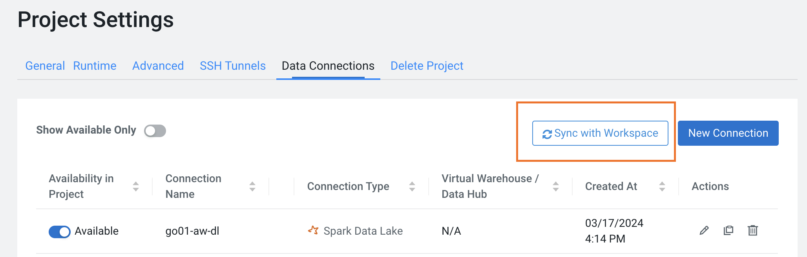
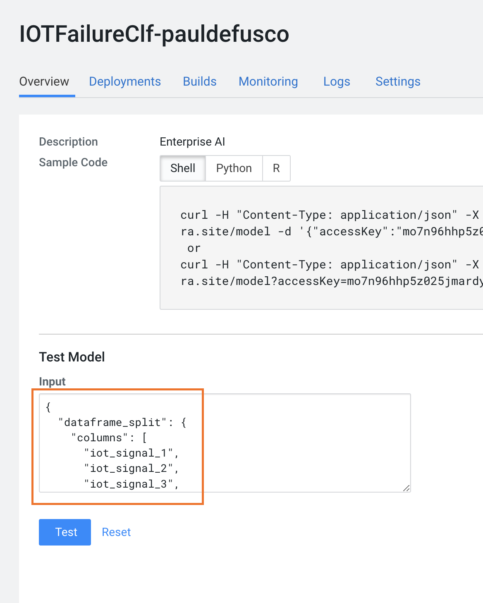
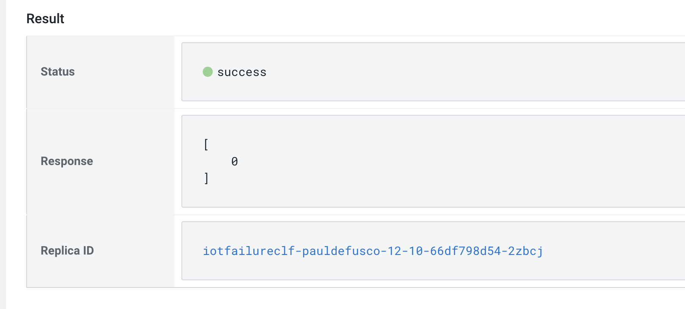

# CML MLOps Logistics Hands On Lab

This is a Hands On Lab (HOL) of Machine Learning applied to Supply Chain & Logistics optimization in Cloudera Machine Learning (CML).

In this HOL you will use CML to analyze multidimensional time series data at scale and identify similar patterns with Unsupervised Learning techniques made available by Stumpy and the Matrix Profile algorithm invented by the University of California, Riverside.

With Stumpy you will train models capable of identifying patterns in long sequences of time series data matching a particular arbitrary motif, and detect time series sequences that are most similar to others.

Among the many use cases, this allows you to spot anomalous time series patterns from moving devices in real time and discover devices that behave in a similar manner over the span of long time windows potentially across millions of units.

## Introduction to CDP and CML

Cloudera Data Platform (CDP) is an enterprise data cloud, which functions as a platform for both IT and the business. It incorporates support for an environment running both on on-premises and in a public cloud setup. CDP also has multi-cloud and multifunction capabilities at the same time as it’s both simple to use and secure by design. It supports both manual and automated functions and is open and extensible.

CDP offers a common environment for both data engineers and data scientists, supporting data science team collaboration. The data platform from Cloudera provides self-service access to integrated, multi-function analytics on centrally managed and secured business data while deploying a consistent experience anywhere — on-premises or in hybrid and multi-cloud. This includes consistent data security, governance, lineage, and control, while deploying the efficient, easy-to-use cloud analytics, eliminating end-user need for shadow IT solutions.

Cloudera Machine Learning (CML) enables enterprises to proactively monitor technical metrics such as service level agreements (SLA) adherence, uptime, and resource use as well as prediction metrics including model distribution, drift, and skew from a single governance interface. Users can set custom alerts and eliminate the model “black box” effect with native tools for visualizing model lineage, performance, and trends. Some of the benefits with CML include:

* Model cataloging and lineage capabilities to allow visibility into the entire ML lifecycle, which eliminates silos and blind spots for full lifecycle transparency, explainability, and accountability.
* Full end-to-end machine learning lifecycle management that includes everything required to securely deploy machine learning models to production, ensure accuracy, and scale use cases.
* An extensive model monitoring service designed to track and monitor both technical aspects and accuracy of predictions in a repeatable, secure, and scalable way.
* New MLOps features for monitoring the functional and business performance of machine learning models such as detecting model performance and drift over time with native storage and access to custom and arbitrary model metrics; measuring and tracking individual prediction accuracy, ensuring models are compliant and performing optimally.
* The ability to track, manage, and understand large numbers of ML models deployed across the enterprise with model cataloging, full lifecycle lineage, and custom metadata in Apache Atlas.
* The ability to view the lineage of data tied to the models built and deployed in a single system to help manage and govern the ML lifecycle.
Increased model security for Model REST endpoints, which allows models to be served in a CML production environment without compromising security.


## Content Overview

The HOL is divided in two parts:

1. MLOps with time series and geospatial data
  - [DEV Project](https://github.com/pdefusco/CML_MLOps_Logistics_DEV)
  - [PRD Project](https://github.com/pdefusco/CML_MLOps_Logistics_PRD)

2. MLOps with MLFlow
  - [MLOps with MLFlow](https://github.com/pdefusco/CML_MLOps_Logistics_Mlflow)


## Requirements

* A CML Workspace on version 2.0.43 or above with internet access enabled.
* Basic familiarity with git, Python and unix scripting.


## Step by Step Instructions

## Part 1: MLOps with time series and geospatial data

### DEV Project

The DEV project hosts artifacts for the development of a model to predict on time series sequences.

In this project you will:

  * 00 Datagen: Run a CML Job to create your own data in Apache Iceberg table format.
  * 01A Maps: Explore geospatial data interactively with Folium and CML Sessions.
  * 01B Geospatial: Use Apache Sedona to perform geospatial search on coordinate data.
  * 02 Model Training: Familiarize yourself with Stumpy for time series machine learning and train your first models.
  * 03 Model Deployment: Deploy a Stumpy time series classifier in an API endpoint in the Production Environment via CML Models and CML APIv2.
  * 04 Model Deployment: Deploy a Stumpy time series Unsupervised learning model in an API endpoint in the Production Environment via CML Models and CML APIv2.

##### Project Setup

Log into the CML Workspace and Create a Project.

In the Project Creation form, ensure that you use a unique name for the project by adding your username to the project name.

Select "git" in the "Initial Setup" page and paste the following URL: https://github.com/pdefusco/CML_MLOps_Logistics_DEV.git


Next, scroll down to the Runtimes section. Remove the default runtimes and add the Python 3.9 runtimes as shown below:

```
Editor: Workbench
Kernel: Python 3.9
Edition: Standard
Version: any version is fine.
```

```
Editor: JupyterLab
Kernel: Python 3.9
Edition: Standard
Version: any version is fine.
```


Finally, create the CML Project.

##### Install Requirements

Enter your project and launch a Session with Workbench Editor.

```
Editor: Workbench
Kernel: Python 3.9
Edition: Standard
Spark Runtime Add-On: Spark 3.2 or above.
Version: any version is fine.
Resource Profile: 2 CPU / 4 GB Mem / 0 GPU
```

Open the terminal window at the top right of your screen and run the following command:

```
pip3 install -r requirements.txt
```


The requirements can take up to a couple of minutes to install.

##### Execute Scripts and Notebooks

###### 1. Data Generation

Each lab participant will create synthetic geospatial data and save it to Apache Iceberg table format.

In the same CML Session, open the "00_datagen.py" script and replace the values for the STORAGE and CONNECTION_NAME variables at lines 178 and 179 with the values provided to you by your Workshop Lead.

Create a CML Job with the following configurations:

```
Name: Data Gen - username
Script: 00_datagen.py
Editor: Workbench
Enable Spark: Spark 3.2 or above
Schedule: Manual
Resource Profile: 2 CPU / 4 GB Mem
```

Leave all other fields to default values. Create and then run the job.


###### 2. Notebooks

Each notebook can be executed separately and comes with instructions. Before running them please you must be mindful of:

* You will have to update the STORAGE and DATA_CONNECTION variables as you did in the prior step.
* Scripts in "ipynb" format must be run in CML Sessions with JupyterLab editor. You can launch a concurrent CML Session to do so.
* Notebook 01B_geospatial_analysis must be run in a new CML Session. This is because Sedona's SedonaContext collides with the SparkContext created in notebook 01A.

Among other things, notebooks 3 and 4 leverage APIv2 to create your PRD project environment. Once you have run these, you will be able to move on to the next step in the labs.


### PRD Project

The PRD project will serve as the production environment for your machine learning models.

When you log into the project for the first time you should find two models.


Before executing the scripts, try an API call to teh TimeSeriesQuery model with the following payload.

```
{"pattern": [54,53,52,51]}
```

In this project you will:

  * 05 Model Simulation: create synthetic requests and submit them to the CML Models endpoint.
  * 06 Model Monitoring: monitor model resource consumption in Production.
  * 07 Model Redeployment: leverage CML APIv2 to redeploy a new model build with additional resources to meet capacity.

##### Project Setup

The project has already been created for you in Notebooks 3 and 4 that you executed in the DEV project.

Navigate to the Project Settings, open the Data Connections tab and sync your Data Connections as shown below:



##### Install Requirements

As in the DEV project, launch a CML Session and install the requirements:

```
pip3 install -r requirements.txt
```

##### Execute Scripts

Run each script in the provided order:

* 05 Model Simulation: execute all the code at once in the Workbench Editor in order to create synthetic model requests and submit them to each of the two models.
  - At line 82 make sure the model name has been updated according to your username and date. You can validate the model name in the Model Deployments UI.
* 06 Model Monitoring: execute all the code at once in the Workbench Editor in order to monitor API endpoint performance.
  - As before, ensure model name is correct at line 55.
* 07 Model Redeployment: execute all the code at once in the Workbench Editor in order to redeploy the API endpoint with increased resources.
  - As before, ensure model name is correct at line 54.

## Part 2: MLOps with MLFlow

CML supports MLFlow Tracking and Registry. With MLFlow tracking you can execute experiments in CML Sessions, automatically package all dependencies and log all metadata in the Tracking UI. Once a model has been recorded, the Registry allows you to stage your best experiment runs and deploy them within the same or another data science environment.

The Registry is commonly used by teams of Machine Learning Engineers as a system to review and test models before they reach the Production Environment, as well as recover important metadata for ML Governance and Regulatory Compliance.

## Step by Step Instructions

##### Project Setup

Log into the CML Workspace and Create a Project.

In the Project Creation form, ensure that you use a unique name for the project by adding your username to the project name.

Select "git" in the "Initial Setup" page and paste the following URL: https://github.com/pdefusco/CML_MLOps_Logistics_Mlflow.git

As you did in Part 1, remove the default runtimes and add the Python 3.9 runtimes as shown below:

```
Editor: Workbench
Kernel: Python 3.9
Edition: Standard
Version: any version is fine.
```

```
Editor: JupyterLab
Kernel: Python 3.9
Edition: Standard
Version: any version is fine.
```

##### Install Requirements

Launch a CML Session with Workbench editor and install requirements:

```
pip3 install -r requirements.txt
```

##### Execute Scripts

Run each script in the provided order:

* 00 Datagen: similar to part 1, you will create an Iceberg table with your synthetic data to train a Machine Learning Model.
* 01 Train XGBoost: in this script you will train an XGBoost classifier to predict Iot Device failures. The training session is logged in the MLFlow Tracking UI. Once you have executed this script, navigate to the Experiments tab to validate your experiment run.  
* 02 Model API Endpoint: similar to part 1, you will use CML APIv2 to registed a model from an Experiment to the MLFlow Registry. Then, you will create the model, build the container image and finally push it to an API endpoint.

When you are done with script 2, navigate to the Model Deployments tab and validate that the model has built. When it has completed the process, send a request to test the endpoint by pasting the json below into the Test Request window:

```
{
  "dataframe_split": {
    "columns": [
      "iot_signal_1",
      "iot_signal_2",
      "iot_signal_3",
      "iot_signal_4"
    ],
    "data": [
      [
        35.5,
        200.5,
        30.5,
        14.5
      ]
    ]
  }
}
```






## Summary and Next Steps

Production ML requirements include packaging, deployment, and serving. Right packaging is necessary for automated deployment of production models and to address multiple deployment patterns. Enterprise level deployments need high availability, autoscaling, and strong authentication features.

Serving makes a trained model available to other software components. Models can be served in batch or real-time modes. Monitoring is an important element of operationalizing ML. After a model is deployed into production and providing utility to the business, it’s necessary to monitor how well the model is performing.

In this two-part HOL you briefly touched on each of the above in CML.

* With CML Session you prototyped and tracked model experiments.  
* With CML Jobs you containerized and isolated heavy-duty workload into isolated job runs.
* Thanks to the flexibility of CML Runtimes you were able to iterate across different model experiments and projects quickly, with all the required packages, frameworks and dependencies, without having to deal with complex environment management configurations.
* In addition, CML runtimes are pre-configured with Apache Iceberg dependencies in order to enable Open Lakehouse Analytics in the context of Data Science.
* With CML Projects you separated your DEV and PRD concerns in different environments. CML Projects enable different levels of authorization roles for each user, preventing unwanted users from accessing Production environments.
* With CML Models you created API endpoints in order to serve real time predictions.
* You used MLFlow Tracking and Registry to centrally monitor all experiment runs and promote promising prototypes into a safe staging environment.
* Finally, leveraging CML APIv2 you created an MLOps pipeline including model testing and monitoring features.

## Related Demos and Tutorials

If you are evaluating CML you may also benefit from testing the following demos:

* [Telco Churn Demo](https://github.com/pdefusco/CML_AMP_Churn_Prediction): Build an End to End ML Project in CML and Increase ML Explainability with the LIME Library
* [Learn how to use Cloudera Applied ML Prototypes](https://docs.cloudera.com/machine-learning/cloud/applied-ml-prototypes/topics/ml-amps-overview.html) to discover more projects using MLFlow, Streamlit, Tensorflow, PyTorch and many more popular libraries
* [CSA2CML](https://github.com/pdefusco/CSA2CML): Build a real time anomaly detection dashboard with Flink, CML, and Streamlit
* [SDX2CDE](https://github.com/pdefusco/SDX2CDE): Explore ML Governance and Security features in SDX to increase legal compliance and enhance ML Ops best practices
* [API v2](https://github.com/pdefusco/CML_AMP_APIv2): Familiarize yourself with API v2, CML's goto Python Library for ML Ops and DevOps
