# CML MLOps Logistics Hands On Lab

This is a Hands On Lab (HOL) of Machine Learning applied to Supply Chain & Logistics optimization in Cloudera Machine Learning (CML).

In this HOL you will use CML to analyze multidimensional time series data at scale and identify similar patterns with Unsupervised Learning techniques made available by Stumpy and the Matrix Profile algorithm invented by the University of California, Riverside.

With Stumpy you will train models capable of identifying patterns in long sequences of time series data matching a particular arbitrary motif, and detect time series sequences that are most similar to others.

Among the many use cases, this allows you to spot anomalous time series patterns from moving devices in real time and discover devices that behave in a similar manner over the span of long time windows potentially across millions of units.


## Content Overview

The HOL is divided in two parts:

1. MLOps with time series and geospatial data
  - [DEV Project](https://github.com/pdefusco/CML_MLOps_Logistics_DEV)
  - [PRD Project](https://github.com/pdefusco/CML_MLOps_Logistics_PRD)

2. MLOps with MLFlow
  - [MLOps with MLFlow](https://github.com/pdefusco/CML_MLOps_Logistics_Mlflow)


## Requirements

* A CML Workspace on version 2.0.43 or above with internet access enabled.
* Basic familiarity with git, Python and unix scripting.


## Step by Step Instructions

## Part 1: MLOps with time series and geospatial data

### DEV Project

The DEV project hosts artifacts for the development of a model to predict on time series sequences.

In this project you will:

  * 00 Datagen: Run a CML Job to create your own data in Apache Iceberg table format.
  * 01A Maps: Explore geospatial data interactively with Folium and CML Sessions.
  * 01B Geospatial: Use Apache Sedona to perform geospatial search on coordinate data.
  * 02 Model Training: Familiarize yourself with Stumpy for time series machine learning and train your first models.
  * 03 Model Deployment: Deploy a Stumpy time series classifier in an API endpoint in the Production Environment via CML Models and CML APIv2.
  * 04 Model Deployment: Deploy a Stumpy time series Unsupervised learning model in an API endpoint in the Production Environment via CML Models and CML APIv2.

##### Project Setup

Log into the CML Workspace and Create a Project.

In the Project Creation form, ensure that you use a unique name for the project by adding your username to the project name.

Select "git" in the "Initial Setup" page and paste the following URL: https://github.com/pdefusco/CML_MLOps_Logistics_DEV.git

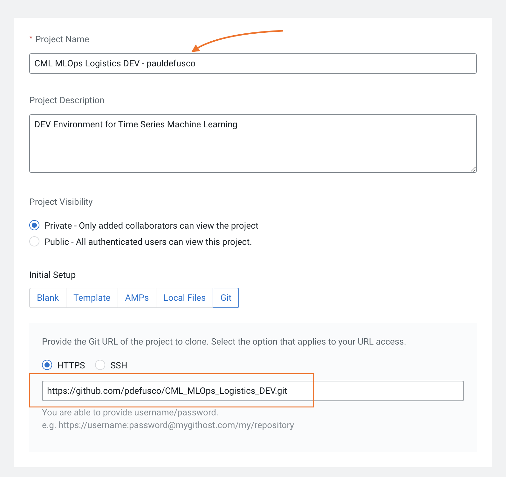

Next, scroll down to the Runtimes section. Remove the default runtimes and add the Python 3.9 runtimes as shown below:

```
Editor: Workbench
Kernel: Python 3.9
Edition: Standard
Version: any version is fine.
```

```
Editor: JupyterLab
Kernel: Python 3.9
Edition: Standard
Version: any version is fine.
```

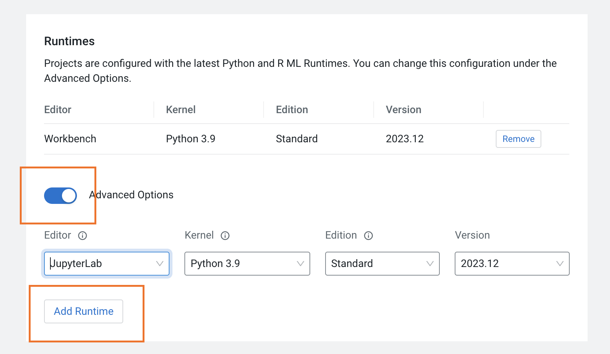

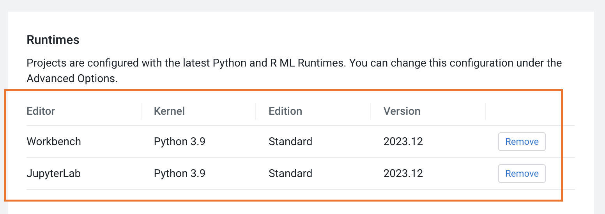

Finally, create the CML Project.

##### Install Requirements

Enter your project and launch a Session with Workbench Editor.

```
Editor: Workbench
Kernel: Python 3.9
Edition: Standard
Spark Runtime Add-On: Spark 3.2 or above.
Version: any version is fine.
Resource Profile: 2 CPU / 4 GB Mem / 0 GPU
```

Open the terminal window at the top right of your screen and run the following command:

```
pip3 install -r requirements.txt
```

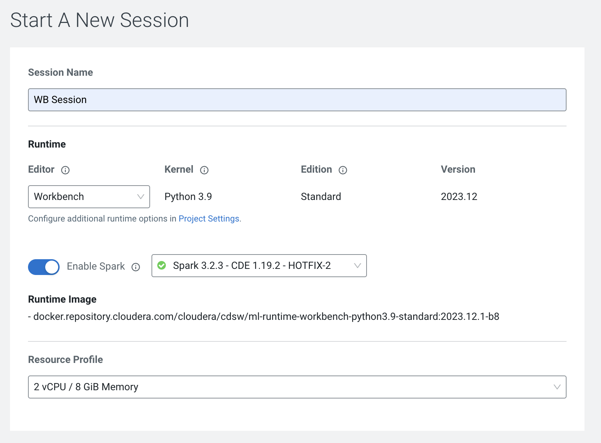

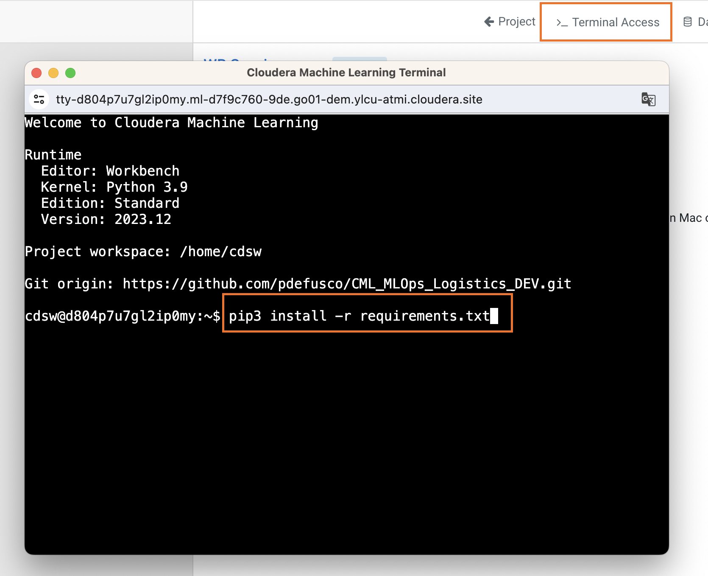

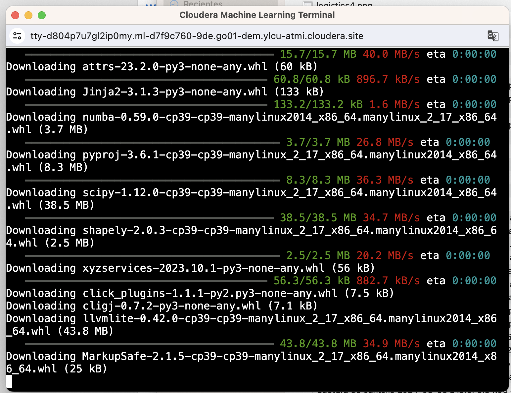

The requirements can take up to a couple of minutes to install.

##### Execute Scripts and Notebooks

###### 1. Data Generation

Each lab participant will create synthetic geospatial data and save it to Apache Iceberg table format.

In the same CML Session, open the "00_datagen.py" script and replace the values for the STORAGE and CONNECTION_NAME variables at lines 178 and 179 with the values provided to you by your Workshop Lead.

Create a CML Job with the following configurations:

```
Name: Data Gen - username
Script: 00_datagen.py
Editor: Workbench
Enable Spark: Spark 3.2 or above
Schedule: Manual
Resource Profile: 2 CPU / 4 GB Mem
```

Leave all other fields to default values. Create and then run the job.

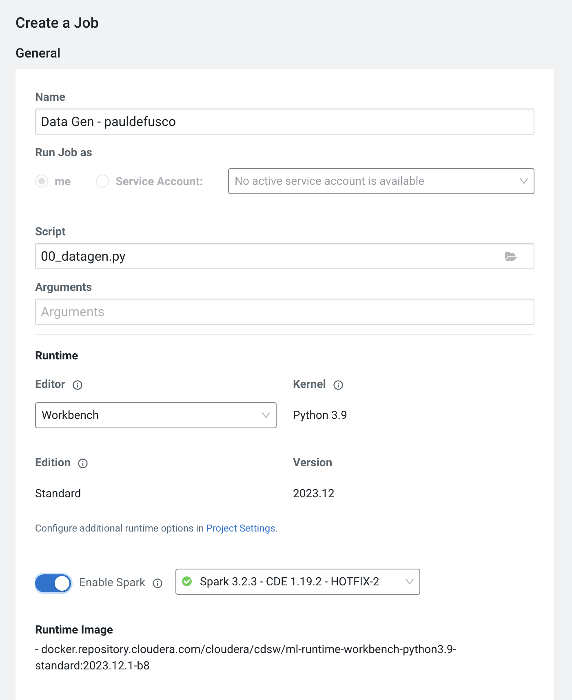

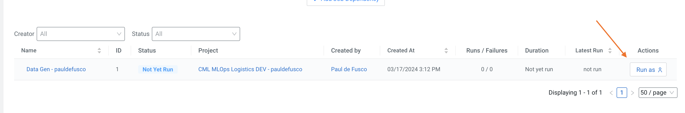

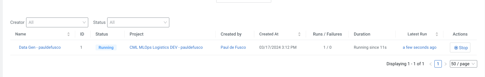

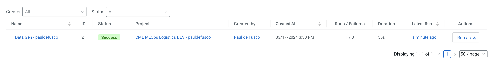

###### 2. Notebooks

Each notebook can be executed separately and comes with instructions. Before running them please you must be mindful of:

* You will have to update the STORAGE and DATA_CONNECTION variables as you did in the prior step.
* Scripts in "ipynb" format must be run in CML Sessions with JupyterLab editor. You can launch a concurrent CML Session to do so.
* Notebook 01B_geospatial_analysis must be run in a new CML Session. This is because Sedona's SedonaContext collides with the SparkContext created in notebook 01A.

Among other things, notebooks 3 and 4 leverage APIv2 to create your PRD project environment. Once you have run these, you will be able to move on to the next step in the labs.

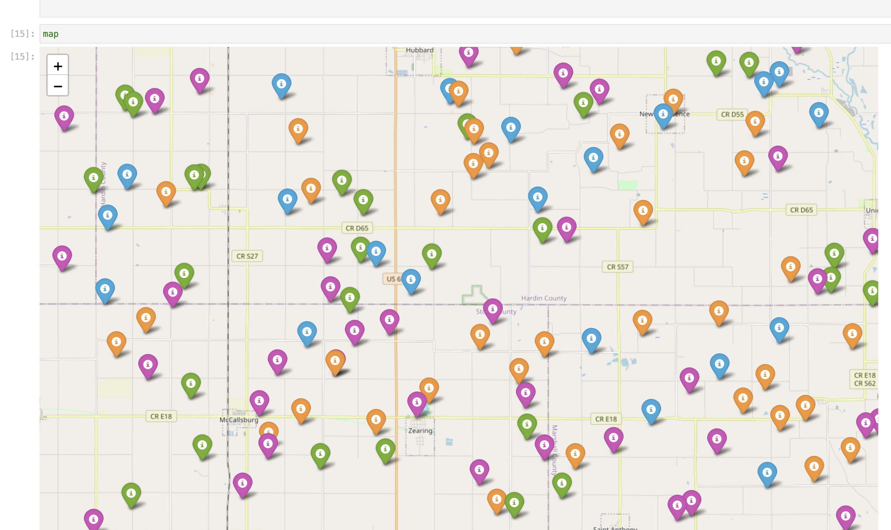

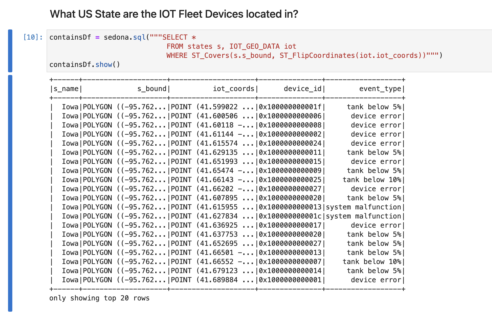


### PRD Project

The PRD project will serve as the production environment for your machine learning models.

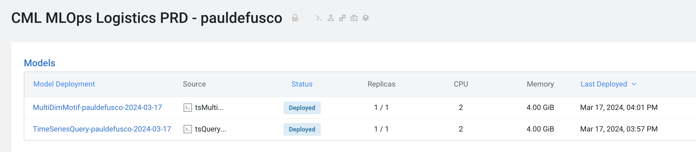

Before executing the scripts, try an API call to teh TimeSeriesQuery model with the following payload.

```
{"pattern": [54,53,52,51]}
```

In this project you will:

  * 05 Model Simulation: create synthetic requests and submit them to the CML Models endpoint.
  * 06 Model Monitoring: monitor model resource consumption in Production.
  * 07 Model Redeployment: leverage CML APIv2 to redeploy a new model build with additional resources to meet capacity.

##### Project Setup

The project has already been created for you in Notebooks 3 and 4 that you executed in the DEV project.

##### Install Requirements

As in the DEV project, launch a CML Session and install the requirements:

```
pip3 install -r requirements.txt
```

##### Execute Scripts

When you log into the project for the first time you should find two models

Run the scripts in


## Part 2: MLOps with MLFlow

CML supports MLFlow Tracking and Registry. With MLFlow tracking you can execute experiments in CML Sessions, automatically package all dependencies and log all metadata in the Tracking UI. Once a model has been recorded, the Registry allows you to stage your best experiment runs and deploy them within the same or another data science environment.

The Registry is commonly used by teams of Machine Learning Engineers as a system to review and test models before they reach the Production Environment, as well as recover important metadata for ML Governance and Regulatory Compliance.

## Step by Step Instructions

##### Project Setup

##### Install Requirements

##### Execute Scripts


## Summary and Next Steps
